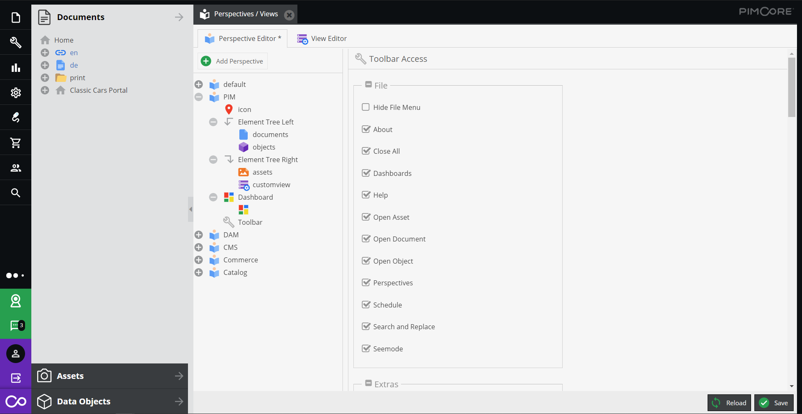
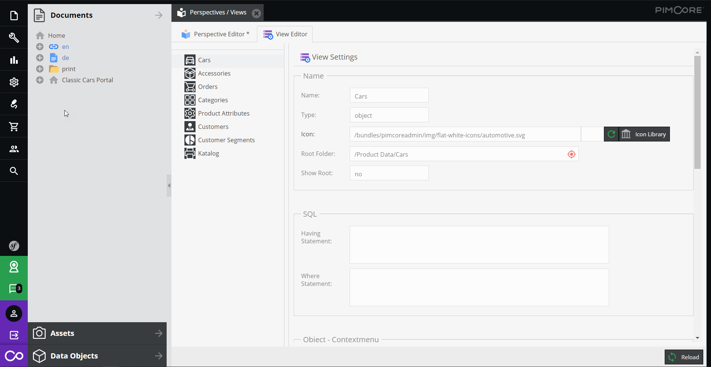

# Pimcore Perspective Editor

This bundle provides an editor for Pimcore that allows to 
- Add/remove/edit custom views
- Add/remove/edit perspectives

and configure most of the possible configuration options directly in the user interface.  

## Further Information
- [Installation & Configuration](./doc/01_Installation.md)
- [Customize Menu Entry List](./doc/02_Customize_Menu_Entry_List.md)
