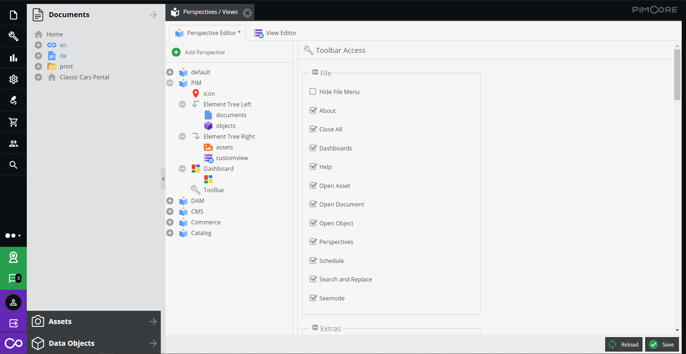
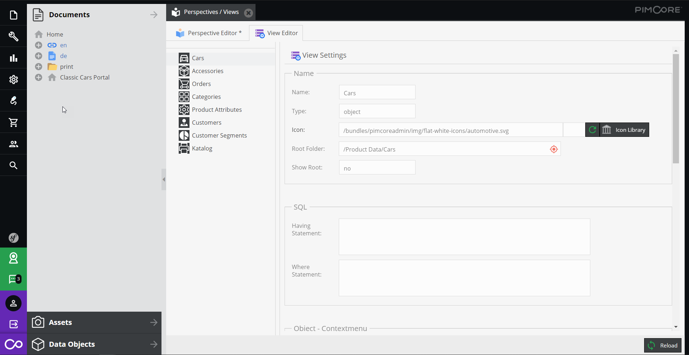

# Pimcore Perspective Editor

> [!WARNING]
> This bundle won't be migrated to Pimcore Studio and therefore will be deprecated with 2.2.

This bundle provides an editor for Pimcore to manage custom views and perspectives.

## Features in a Nutshell
- Possibility to add, remove or edit custom views.
- Possibility to add, remove or edit perspectives.
- Configuration directly in the user interface.

*Sample Perspective Editor*

*Sample View Editor*

## Documentation Overview
- [Installation & Configuration](./doc/01_Installation.md)
- [Customize Menu Entry List](./doc/02_Customize_Menu_Entry_List.md)
- [Upgrade Notes](./doc/03_Upgrade.md)
